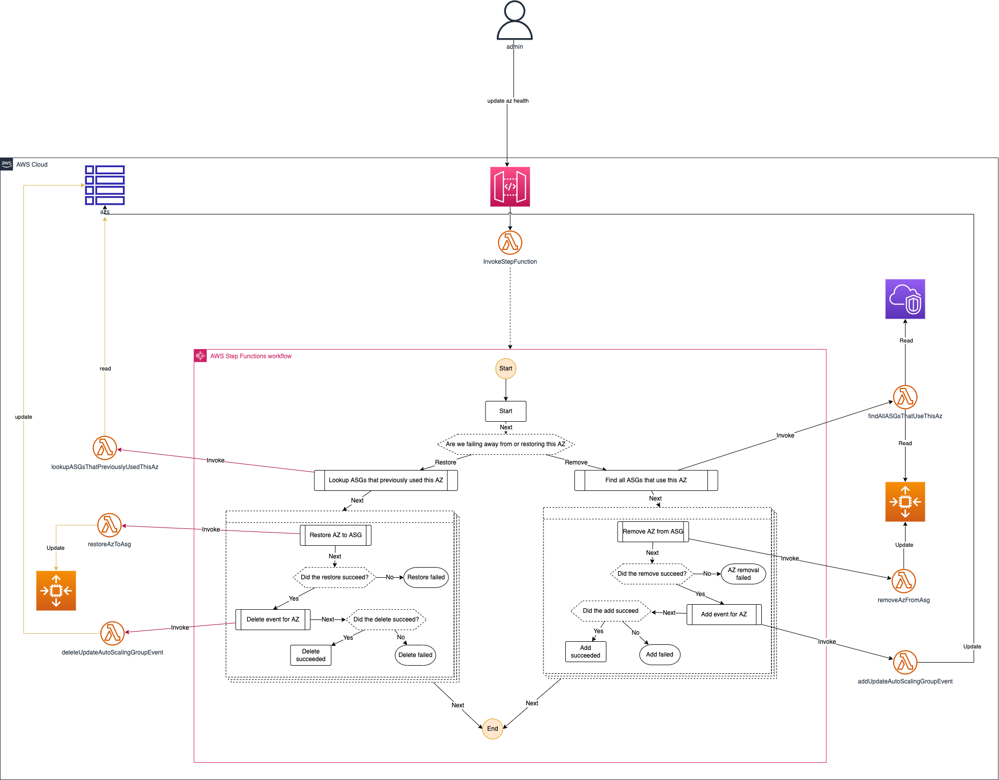

# az-fail-away

This project provides a serverless infrastructure for updating the availability zones of autoscaling groups en masse.

## Architecture

## Stacks

* AzFailAwayStack - This stack sets up the serverless application described in the architecture diagram
* TestAsgStack - This stack creates a specified number of asgs for testing the AzFailAwayStack

## ⚠️ Warning ⚠️
The AzFailAwayStack deploys an **unsecured** HTTP API to API Gateway! Before leveraging this solution in a real world environment be sure to implement proper [access controls](https://docs.aws.amazon.com/apigateway/latest/developerguide/http-api-access-control.html) 
according to your organization's security guidelines. Not doing so could allow unauthorized updates of your infrastructure.

## Useful commands

 * `npm run build`   compile typescript to js
 * `cdk deploy -c account=<your_account> -c region=<your_region> AzFailAwayStack`
 * `cdk deploy -c account=<your_account> -c region=<your_region> -c vpcId <your_vpc_id> TestAsgStack`
